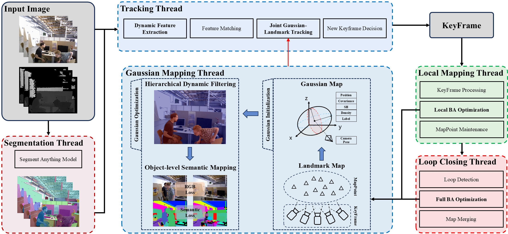

# DOG-SLAM: Dynamic Object-level SLAM via Tightly Coupling 3D Gaussian Splatting

## Abstract

Recent advancements in 3D Gaussian Splatting (3DGS) have significantly improved the mapping quality and computational efficiency of visual Simultaneous Localization and Mapping (SLAM). 

We propose DOG-SLAM, a novel framework that integrates 3DGS into its core pipeline, enabling accurate camera pose tracking, object-level interaction, and high-fidelity scene reconstruction in dynamic environments. Firstly, **a local hybrid map optimization** tightly couples and integrates Gaussian and landmark constraints to jointly refine camera poses, enabling precise alignment of tracking and mapping through unified parameter adjustments. Secondly, **a consistent object-level semantic fusion module** embeds category labels into 3D Gaussians, grouping them via semantic consistency and optimizing distributions through cross-view losses to support scene manipulation. Finally, **a multi-stage dynamic object filtering pipeline** integrates segmentation and visibility-aware pruning, ensuring robust static map construction in dynamic scenes. 

Extensive experiments on the TUM and BONN datasets demonstrate that DOG-SLAM reduces the absolute trajectory error by 85.99\% compared to state-of-the-art 3DGS-based SLAM, while achieving a PSNR of 25.73 dB in dynamic scenes. Additionally, the object-level semantic maps of the system further enable advanced applications, representing a significant step toward robust SLAM in dynamic environments.

---

## Pipeline Overview

The DGS-SLAM pipeline incorporates Gaussian Splatting, robust filtering, keyframe management, and loop-aware optimization. Below is a visual representation of the process:

---

##  Under Review

This work is currently **under review**, and the code will be released soon. Stay tuned for updates!

## 
